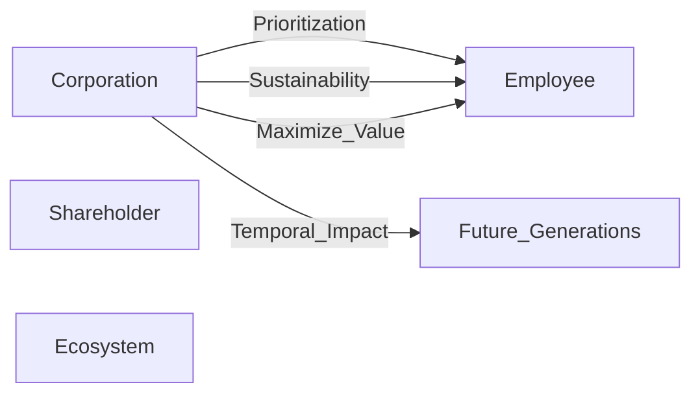

# Graph #1: translation — Extractive corporate graph

**Phase**: translation
**Objects**: 5
**Morphisms**: 4

## Source

> A corporation that prioritizes shareholder value over employee welfare and environmental sustainability.

## Objects

| Label | Tags |
|-------|------|
| Corporation | `stakeholder, actor, shareholder_primacy_risk` |
| Shareholder | `stakeholder, sink` |
| Employee | `stakeholder, vulnerable` |
| Future_Generations | `stakeholder, vulnerable, shadow_entity, temporal` |
| Ecosystem | `stakeholder, vulnerable, shadow_entity, ecological` |

## Morphisms

| Label | Source → Target | Tags |
|-------|-----------------|------|
| Prioritization | Corporation → Employee | `decision` |
| Sustainability | Corporation → Employee | `protection` |
| Maximize_Value | Corporation → Employee | `maximize_value, fiduciary_duty` |
| Temporal_Impact | Corporation → Future_Generations | `neglect, temporal_harm, shadow_impact` |

## Diagram

## Links

- [[Manifesto]]
